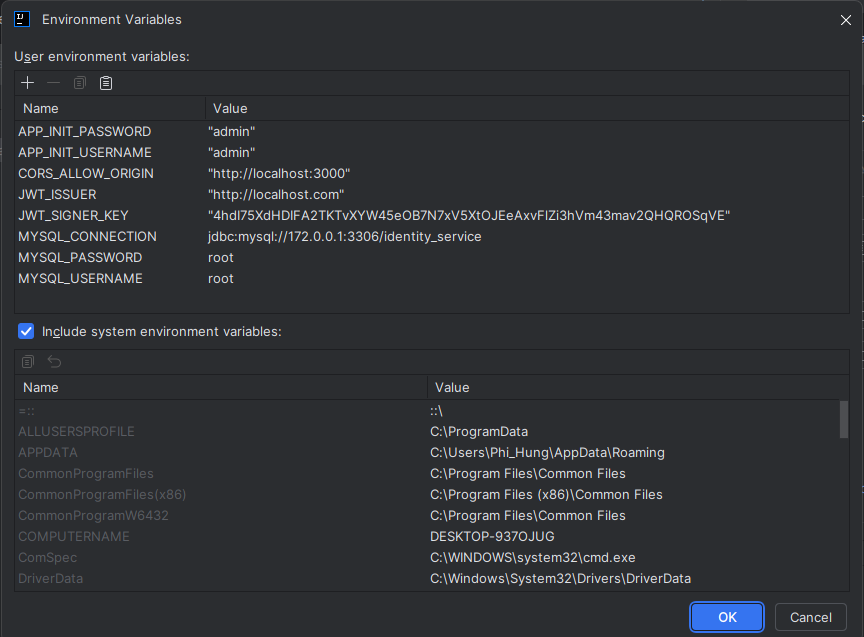

# Identity Service API Application

## 1. Run Application Guideline
**Ensure that your device has been installed Java 21, Maven, and Docker Desktop before following the steps below**

*Java and maven versions will be used in this project:*
- Java version: 21.0.5
- Maven version: 3.9.8
### Step 1: Setup MySQL Database
- Pull MySQL server from Docker Hub:
```dockerfile
  docker pull mysql:8.0.36-debian
```
- Starting MySQL server:
```dockerfile
  docker run -p 3306:3306 -e MYSQL_ROOT_PASSWORD=root --name mysql-server -t mysql:8.0.36-debian
```
- Download and install MySQL workbench in there: https://dev.mysql.com/downloads/workbench/
- Creating MySQL connection interact with MySQL server:
  + Connection Name: `identity-service`
  + Hostname: `127.0.0.1`
  + Port: `3306`
  + Username: `root`
  + Password: `root`
  + Default Schema: `identity-service` (for the first connection, there's no need to config)
- Create a new schema called: identity-service (for the first setting)

### Step 2: Application Configuration
- clone src from Git Hub:
```bash
  git clone https://github.com/VinhTuan-Nguyen/identity-service.git
```
- Execute command prompt:
```shell
  mvn clean install -DskipTests
```
- Make sure that the application build is successful
- Download and install IntelliJ IDEA Community Edition: `https://www.jetbrains.com/idea/download/?section=windows`
- Open this project by Intellij
- Run project for first time (At this time, it will throw an error. but it's necessary to create a running configuration)
- Click `Main menu` > `Run` > `Edit Configurations...` > `Environment variables` and then click and copy variables below



- Environment Variables Example:
  + CORS_ALLOW_ORIGIN=`http://localhost:3000`
  + APP_INIT_USERNAME=`admin`
  + APP_INIT_PASSWORD=`admin`
  + MYSQL_CONNECTION=`jdbc:mysql://172.0.0.2:3306/identity_service`
  + MYSQL_USERNAME=`root`
  + MYSQL_PASSWORD=`root`
  + JWT_SIGNER_KEY=`4hdI75XdHDIFA2TKTvXYW45eOB7N7xV5XtOJEeAxvFlZi3hVm43mav2QHQROSqVE`
  + JWT_ISSUER=`http://localhost.com`
- Make sure this application will work properly

## 2.Using Docker to Build & Deploy Application
- Build Application
```dockerfile
docker build -t identity-service:1.0.0 .
```
- Run Application
```dockerfile
docker run --network identity-service --name identity-service -p 8080:8080 \
    -e CORS_ALLOW_ORIGIN=http://localhost:3000 \
    -e APP_INIT_USERNAME=admin \
    -e APP_INIT_PASSWORD=admin \
    -e MYSQL_CONNECTION=jdbc:mysql://mysql-server:3306/identity_service \
    -e MYSQL_USERNAME=root \
    -e MYSQL_PASSWORD=root \
    -e JWT_SIGNER_KEY=4hdI75XdHDIFA2TKTvXYW45eOB7N7xV5XtOJEeAxvFlZi3hVm43mav2QHQROSqVE \
    -e JWT_ISSUER=http://localhost.com \
    -d vinhtuanbm/identity-service:1.0.0
```

## 2. Application Structure
